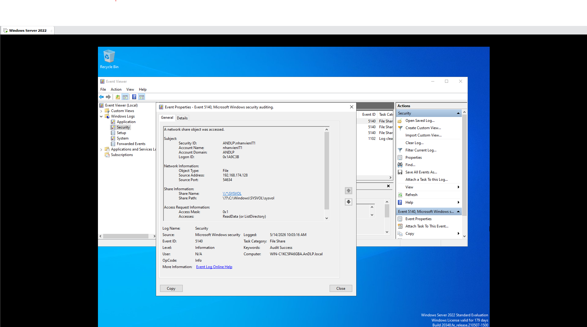
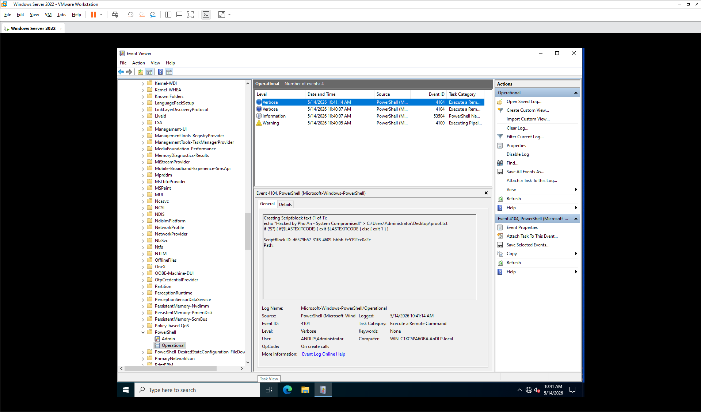

# 🛡️ Nhật Ký Điều Tra & Phân Tích Sự Cố Active Directory

**Ngày thực hiện:** 14/05/2026
**Điều tra viên:** Dương Lê Phú An
**Trạng thái:** Hoàn tất trích xuất bằng chứng (Evidence Collected)

> 🔙 **Xem lại:** Cuộc tấn công của phe Đỏ (Red Team) tại bài **[13/05/2026 — AD Penetration Testing](#/2026-05-13)**.

---

## I. Tổng quan sự cố (Executive Summary)
Hệ thống giám sát phát hiện dấu hiệu xâm nhập trái phép vào Domain Controller. Kẻ tấn công đã để lại tệp tin `hacked.txt` trên Desktop của tài khoản Quản trị viên. Nhiệm vụ của đội phản ứng nhanh là truy ngược dòng thời gian để xác định: **Nguồn gốc (IP), Phương thức (Vector) và Hành vi (Actions)** của kẻ tấn công.

---

## II. Các bước điều tra chi tiết (Step-by-Step Investigation)

### Bước 1: Phân tích mốc thời gian và Độ lệch hệ thống
Khi bắt đầu, chúng ta phát hiện sự sai lệch mốc thời gian giữa log hệ thống và thực tế (do máy ảo bị Suspend). 
- **Giờ thực tế:** 10:00 AM - 10:30 AM ngày 14/05.
- **Giờ hệ thống máy chủ:** ~07:40 PM ngày 13/05.
*Phòng thủ chuyên nghiệp đòi hỏi phải luôn đối chiếu mốc thời gian (Timestamp) để tránh bỏ lỡ các sự kiện quan trọng.*

### Bước 2: Truy vết Initial Access qua SMB (Event ID 5140)
Kẻ tấn công thường bắt đầu bằng việc trinh sát (Reconnaissance). 
- **Vấn đề:** Mặc định Windows không ghi log truy cập File Share.
- **Hành động:** Kích hoạt Advanced Audit Policy: `Object Access > Audit File Share`.
- **Kết quả:** Tóm gọn sự kiện truy cập vào thư mục nhạy cảm.
  - **Account:** `nhanvienIT1`
  - **Source IP:** `192.168.174.128`
  - **Target:** `\\*\SYSVOL`
  - **Nhận định:** Kẻ tấn công đã khai thác lỗ hổng mật khẩu viết cứng (Hardcoded) trong Script để lấy quyền.

### Bước 3: Xác nhận chiếm quyền WinRM (Event ID 91)
Sau khi có mật khẩu Admin, kẻ tấn công dùng `evil-winrm` để lấy Shell.
- **Vấn đề:** Log Security 4624 có thể bị nhiễu do mật độ đăng nhập cao.
- **Hành động:** Pivot sang `Applications and Services Logs > Microsoft > Windows > WinRM > Operational`.
- **Kết quả:** **Event ID 91** xác nhận một kết nối từ xa được thiết lập thành công từ IP `192.168.174.128` đúng thời điểm xảy ra sự cố.

### Bước 4: Lột trần hành vi qua PowerShell Script Block Logging (Event ID 4104)
Đây là bằng chứng đắt giá nhất. Mọi lệnh gõ từ xa đều được ghi lại nguyên văn.
- **Hành động:** Bật Policy `Turn on PowerShell Script Block Logging` qua GPO.
- **Kết quả:** Hệ thống trích xuất được câu lệnh "đánh dấu chủ quyền":
  - **Nội dung:** `echo "This computer has been hacked ! give me your money or i will publish all the passwords :)" > C:\Users\Administrator\Desktop\hacked.txt`
  - **Nhận định:** Xác nhận kẻ tấn công đã có quyền tối cao (Full Control) trên hệ thống.

---

## III. Indicators of Compromise (IoC)
Dưới đây là các dấu hiệu nhận diện cuộc tấn công được trích xuất:
| Loại | Giá trị | Mô tả |
| :--- | :--- | :--- |
| **IP Address** | `192.168.174.128` | Máy tấn công (Attacker) |
| **Account** | `nhanvienIT1`, `Administrator` | Tài khoản bị thỏa hiệp |
| **Dịch vụ** | `SMB (445)`, `WinRM (5985)` | Các cổng dịch vụ bị lợi dụng |
| **Hành vi** | `Execution of PowerShell scripts` | Tạo file và ghi log |

---

## IV. Đề xuất khắc phục ngay lập tức (Remediation)
1. **Cô lập:** Ngắt kết nối IP `192.168.174.128` khỏi dải mạng nội bộ.
2. **Làm sạch:** Xóa toàn bộ tệp tin `.bat` chứa mật khẩu trong thư mục `SYSVOL`.
3. **Reset:** Đổi mật khẩu cho toàn bộ tài khoản đặc quyền và **reset tài khoản `krbtgt` 2 lần** (để xóa Golden Ticket tiềm tàng).
4. **Củng cố:** Chặn Port 5985 trên Firewall, chỉ cho phép các IP quản trị cụ thể (Whitelist).

---

## V. Bài học rút ra (Takeaways)

1. **Audit Policy là bắt buộc:** Hệ thống không ghi log = hệ thống mù. Luôn bật `Object Access`, `Logon Events`, và `PowerShell Script Block Logging` từ ngày đầu triển khai.
2. **Timestamp là vũ khí:** Kẻ tấn công có thể thao túng giờ hệ thống. Hãy luôn đối chiếu log với NTP server và thực tế trước khi kết luận.
3. **WinRM Operational log là "nhân chứng thầm lặng":** Khi Security log bị nhiễu, hãy pivot sang `Applications and Services Logs > WinRM > Operational` để tìm Event ID 91.

---

## VI. Kết luận
Lỗ hổng bắt đầu từ một file script nhỏ bé nhưng kết thúc bằng việc mất toàn bộ quyền kiểm soát Domain. Việc cấu hình **Audit Policy** không đầy đủ chính là "đồng phạm" giúp kẻ tấn công tàng hình trong giai đoạn đầu.

> 🔴 **Tiếp theo:** Xem cuộc phản công của Blue Team và đòn đáp trả bất ngờ của Red Team trong bài **[15/05/2026 — Chiến Ký Red vs Blue](#/2026-05-15)**.
