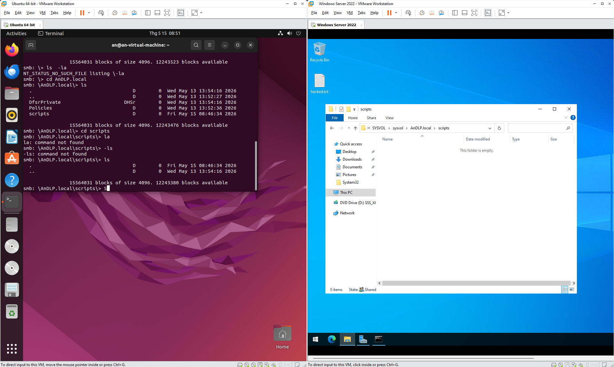
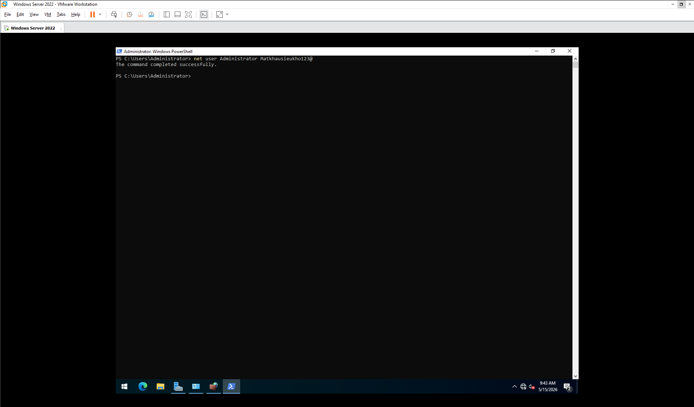
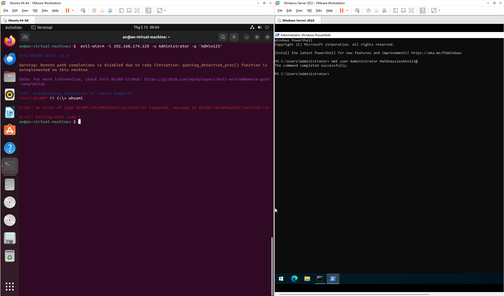
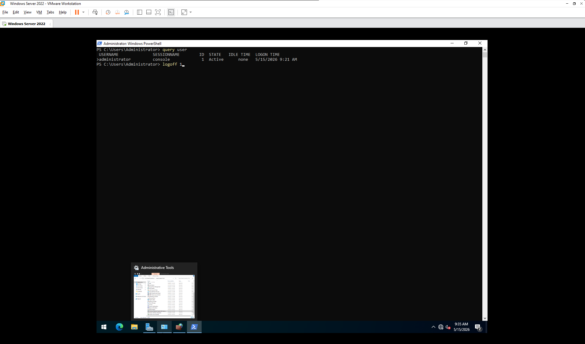
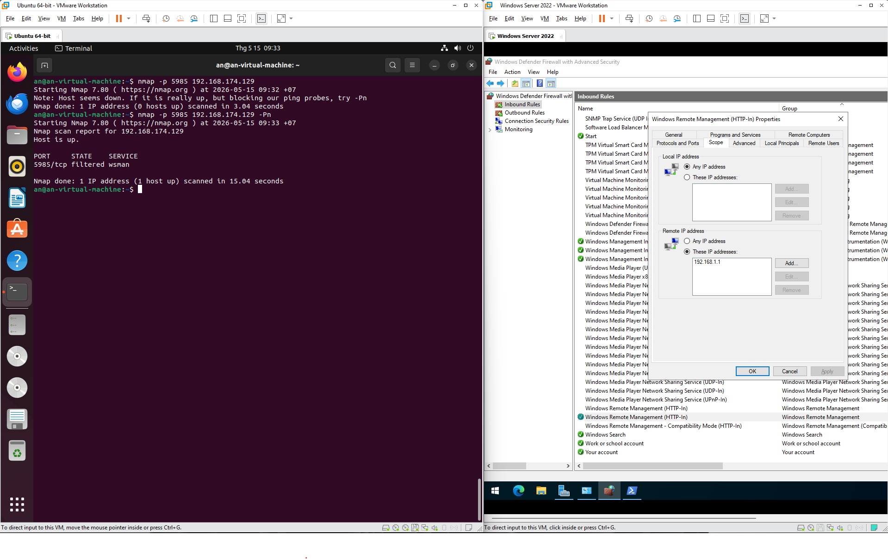

# 🛡️ Nhật Ký Phản Ứng Sự Cố - Hiệp 1: Gia Cố Thành Trì

**Ngày thực hiện:** 15/05/2026
**Vai trò:** Blue Team (System Administrator / Incident Responder)
**Mục tiêu:** Windows Server 2022 (192.168.174.129)
**Trạng thái:** Hoàn thành giai đoạn Hardening cơ bản.

---

## I. Tổng quan giai đoạn (Executive Summary)
Tiếp nối sự cố xâm nhập ngày 13/05, đội phản ứng nhanh (Blue Team) đã tiến hành giai đoạn phản ứng (Remediation). Trọng tâm của hiệp 1 là thực hiện chiến thuật "bế quan tỏa cảng": Vô hiệu hóa quyền truy cập trái phép hiện có và thiết lập các lớp rào cản vật lý (Firewall) để ngăn chặn các nỗ lực xâm nhập tiếp theo.

---

## II. Các hành động khắc phục (Remediation Steps)

### 1. Dọn dẹp "Mồi nhử" (Cleanup)
Hành động ưu tiên là loại bỏ nguyên nhân gốc rễ dẫn đến việc lộ lọt thông tin. Tệp tin `password.bat` chứa mật khẩu plaintext trong thư mục `SYSVOL` phải được tiêu hủy ngay lập tức.

*   **Hành động:** Xóa bỏ tệp tin script cấu hình sai.
*   **Kết quả:** Loại bỏ nguy cơ các người dùng khác trong Domain tiếp tục tìm thấy mật khẩu quản trị.

### 2. Cuộc chiến với những "Chìa khóa cũ" (Password Rotation)
Sau khi dọn dẹp mồi nhử, chúng ta tiến hành thay đổi thông tin xác thực để cắt đứt quyền truy cập dựa trên thông tin đã bị lộ.

*   **Thao tác:** Sử dụng lệnh `net user Administrator [NewPassword]` trên máy chủ.
*   **Kết quả:** Vô hiệu hóa mật khẩu cũ (`P@ssw0rd_Leaked`), buộc kẻ tấn công phải tìm cách khác nếu muốn đăng nhập mới.

### 3. Sự thật về "Bóng ma Session" (Session Persistence)
Một phát hiện quan trọng trong quá trình điều tra: **Đổi mật khẩu không làm hacker văng ra ngay lập tức.** 

*   **Hiện tượng:** Dù mật khẩu đã đổi, kẻ tấn công vẫn thực hiện được lệnh `whoami` do phiên làm việc (Access Token) cũ vẫn còn hiệu lực trong bộ nhớ.
*   **Khắc phục:** Thực hiện "Kill Session" bằng cách khởi động lại dịch vụ WinRM.
*   **Lệnh:** `Restart-Service WinRM`

### 4. Xây tường cao, hào sâu (Firewall Hardening)
Không chỉ chặn người, chúng ta còn phải chặn cả "đường đi" bằng cách thắt chặt luật tường lửa.

*   **Chiến thuật:**
    *   **Disable Public Profile:** Vô hiệu hóa cổng quản trị WinRM (5985) trên môi trường mạng công cộng.
    *   **IP Whitelisting (Scope):** Cấu hình **Remote IP address** trong Inbound Rule để chỉ cho phép các IP quản trị tin cậy được quyền tiếp cận cổng 5985.

### 5. Kiểm chứng thực tế (Validation)
Sử dụng công cụ quét cổng `nmap` từ máy Ubuntu của Attacker để kiểm tra độ vững chắc của tường lửa.

*   **Trạng thái mong muốn:** `5985/tcp filtered`.
*   **Kết quả:** Tường lửa thực hiện **Silent Drop**, khiến kẻ tấn công không thể thu thập thông tin về dịch vụ, tạo lớp sương mù che giấu hệ thống.

---

## III. Indicators of Hardening (IoH)
| Thành phần | Trạng thái cũ | Trạng thái mới | Ghi chú |
| :--- | :--- | :--- | :--- |
| **Bait File** | Tồn tại (`password.bat`) | Đã xóa (Deleted) | Loại bỏ Hardcoded Creds |
| **Admin Password** | Bị lộ (Plaintext) | Đã xoay vòng (Rotated) | Sử dụng mật khẩu phức tạp |
| **WinRM Session** | Tồn tại (Active) | Đã xóa (Purged) | Reset dịch vụ WinRM |
| **Firewall Scope** | `Any` | `Admin_VLAN_Only` | Whitelist IP cụ thể |

---

## ⚠️ Cảnh báo cho Hiệp 2: Sự trỗi dậy của Hash
Dù thành trì đã vững, mật khẩu đã đổi, nhưng chúng ta vẫn đang đứng trước một mối đe dọa thầm lặng: **NTLM Hash**. Hacker đã kịp lấy được "dấu vân tay" của mật khẩu cũ. Liệu kỹ thuật **Pass-the-Hash** có thể xuyên thủng lớp phòng thủ mà chúng ta vừa xây dựng?

*Câu trả lời sẽ có trong Hiệp 2: Cuộc tấn công không cần mật khẩu.*

---

> 💡 **Kết luận:** Làm đến đâu, tài liệu hóa (Documentation) đến đó. Tài liệu này không chỉ là nhật ký, mà còn là bằng chứng về sự chuyển biến của hệ thống từ "mở toang" sang "pháo đài".
