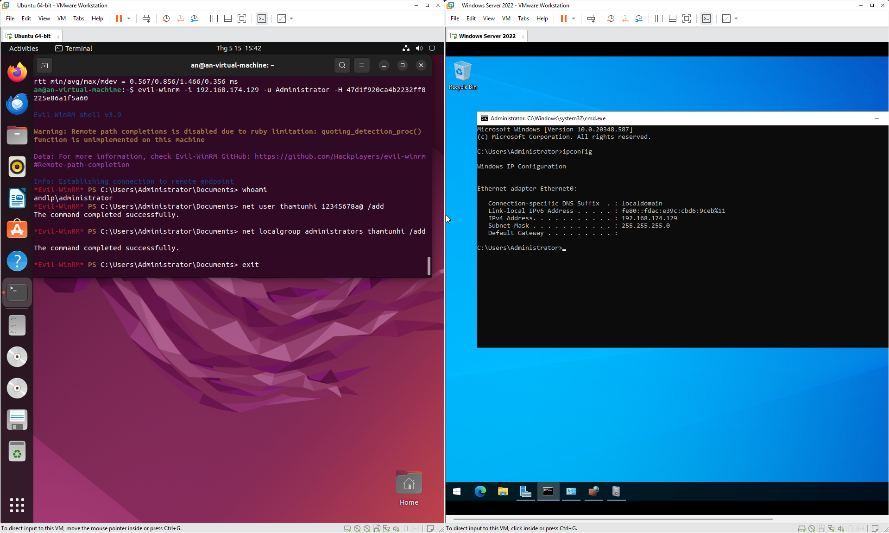
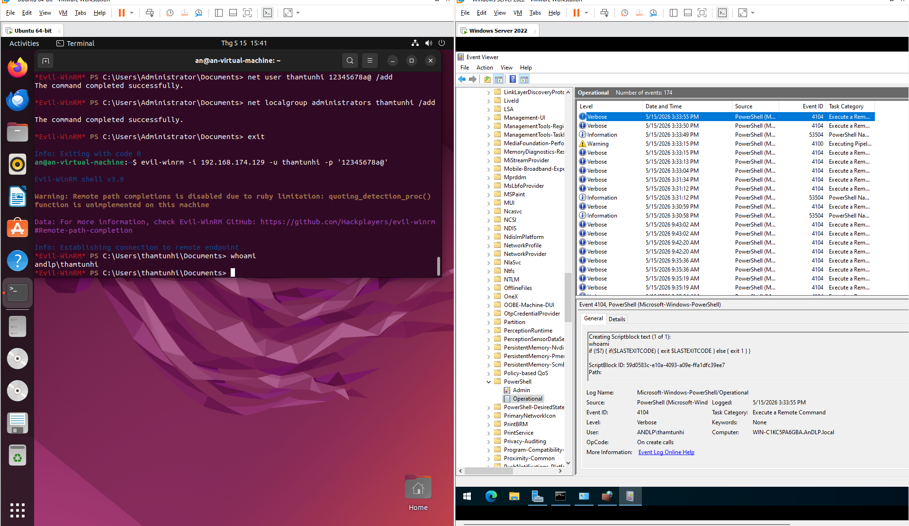
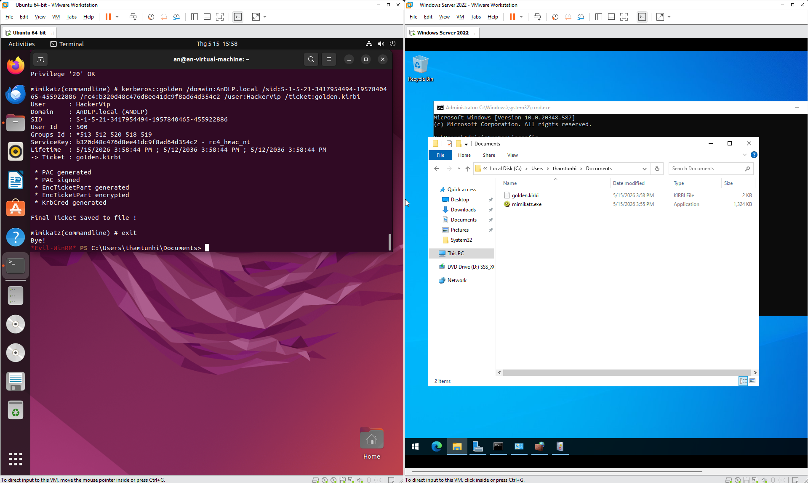
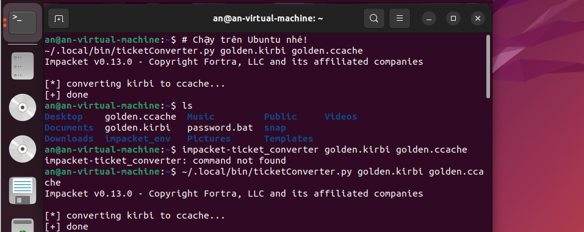
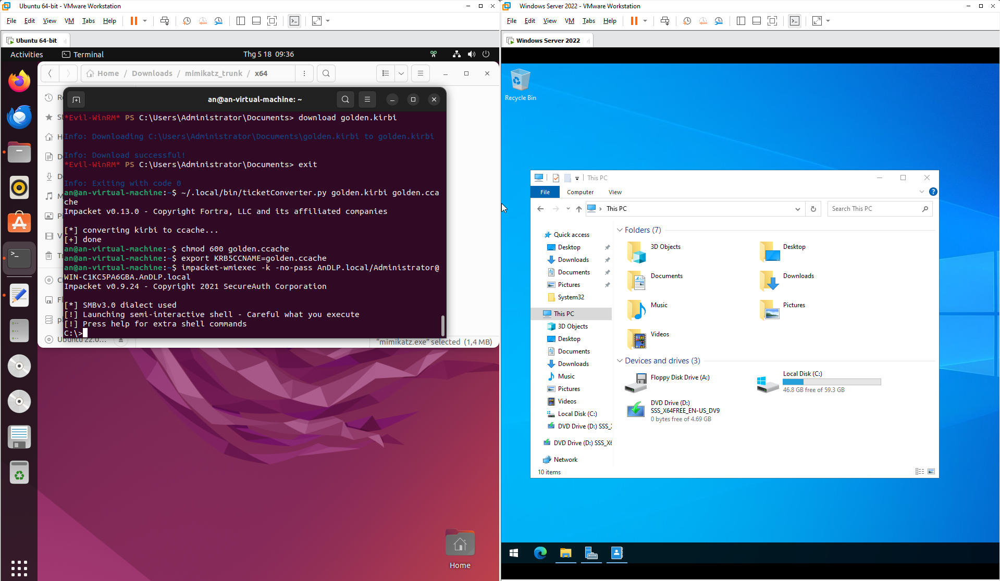

# 🛡️ CHIẾN KÝ RED VS BLUE: TRẬN CHIẾN TẠI AnDLP

**Ngày thực hiện:** 15/05/2026
**Mục tiêu:** Windows Server 2022 (192.168.174.129)
**Điều tra viên:** Dương Lê Phú An
**Tính chất:** Báo cáo thực địa Lab Active Directory

> 🔙 **Xem lại:** Bối cảnh điều tra từ phía Blue Team tại bài **[14/05/2026 — AD Incident Response & Forensics](#/2026-05-14)**.

---

## I. 🛡️ HIỆP 1: PHE XANH GIA CỐ THÀNH TRÌ (Sáng)

Tiếp nối sự cố xâm nhập ngày 13/05, đội phản ứng nhanh (Blue Team) đã tiến hành giai đoạn phản ứng (Remediation). Trọng tâm của hiệp 1 là thực hiện chiến thuật "bế quan tỏa cảng": Vô hiệu hóa quyền truy cập trái phép hiện có và thiết lập các lớp rào cản vật lý (Firewall).

### Bước 1: Dọn dẹp mồi nhử (Cleanup)
Hành động ưu tiên là loại bỏ nguyên nhân gốc rễ. Tệp tin script cấu hình sai chứa mật khẩu plaintext phải được tiêu hủy ngay lập tức.
*   **Thao tác thực hiện:** Truy cập thư mục SYSVOL và xóa bỏ hoàn toàn tệp tin `password.bat`.

### Bước 2: Xoay vòng mật khẩu (Password Rotation)
*   **Lệnh thực hiện:** `net user Administrator [Mật_khẩu_mới]`
*   **Chi tiết kỹ thuật:** Ghi đè mật khẩu cũ (`P@ssw0rd_Leaked`). Mọi nỗ lực xác thực mới (Authentication) bằng pass cũ sẽ bị từ chối.

### Bước 3: Chấm dứt các phiên làm việc hiện hữu (Kill Session)
*   **Lệnh thực hiện:** `Restart-Service WinRM -Force`
*   **Chi tiết kỹ thuật:** Khởi động lại dịch vụ WinRM để "Kill" toàn bộ token và ngắt kết nối hệ thống của Attacker.

### Bước 4: Kiểm chứng hiệu lực tổng thể (Verification)
Đứng từ máy Attacker giả lập truy cập, máy chủ lập tức trả về lỗi xác thực `HTTP 401` và `Access Denied`.

### Bước 5: Thiết lập Tường lửa & Kiểm tra (Firewall Hardening)
Thu hẹp bề mặt tấn công của cổng 5985 bằng cách cấu hình **IP Whitelisting** trong Inbound Rule của Windows Defender Firewall.
*   **Kết quả:** Quét `nmap` từ máy Attacker bị trả về trạng thái `filtered` (Silent Drop).

## II. ⚔️ HIỆP 2: SỰ TRỖI DẬY CỦA HASH (Chiều)

Chứng minh rằng: Trong môi trường doanh nghiệp, **đổi mật khẩu chỉ là cắt ngọn**, còn **kiểm soát định danh mới là gốc rễ**.

### Bước 1: Tuyệt kỹ Pass-the-Hash (PtH)
Sau khi phe Xanh đổi mật khẩu, phe Đỏ tung đòn phản công bằng **NTLM Hash**.
* **Kỹ thuật:** Sử dụng `evil-winrm` với tham số `-H` (Hash) thay cho mật khẩu thô.
* **Kết quả:** Đăng nhập thành công mà không cần biết mật khẩu mới.

### Bước 2: Kỹ thuật "Ve sầu thoát xác" (Persistence)
Để đề phòng phe Xanh tiếp tục đổi pass, phe Đỏ tạo ra một "bóng ma" trong hệ thống:
* **Hành động:** Tạo Local User mang tên `thamtunhi`, cấp quyền `Administrators`.

### Bước 3: Chiếc vé Hoàng Kim (Golden Ticket Attack)
Đòn đánh "chí mạng" nhất: Nhắm vào tài khoản **`krbtgt`** – trái tim của hệ thống Kerberos.
* **Quy trình:**
  1. Trộm Hash của `krbtgt` và đúc vé TGT giả mạo (thời hạn tới năm 2036).
  
  
  
  2. Chuyển đổi định dạng từ `.kirbi` sang `.ccache` để điều khiển từ xa trên Linux.
  
  

### Bước 4: Cuộc chiến với "Vùng lầy" Linux
* **Giải pháp:** Sử dụng `pipx` để đóng gói công cụ Impacket và cấu hình file `/etc/hosts` để Ubuntu có thể "nhìn thấy" Domain Controller.

---

## III. 🏁 KẾT CỤC BẤT NGỜ: CHIẾN THẮNG CỦA SỰ CHỦ ĐỘNG

Dù phe Đỏ đã có chiếc vé vạn năng, nhưng nỗ lực cuối cùng đã bị chặn đứng bởi lỗi: **`KDC_ERR_TGT_REVOKED`**.

**Lý do:** Blue Team đã thực hiện "quyền năng tối thượng" – **Reset mật khẩu `krbtgt` 2 lần**.

> *Khi trái tim của hệ thống thay đổi nhịp đập, mọi chiếc vé giả mạo dù lộng lẫy đến đâu cũng lập tức biến thành giấy vụn.*

---

## IV. 💡 BÀI HỌC RÚT RA (Takeaways)

1. **Đừng tin vào mật khẩu:** Hãy tin vào việc giám sát hành vi (Logs). Độ dài mật khẩu vô nghĩa nếu bị mất Hash.
2. **Nguyên tắc đặc quyền tối thiểu:** Không cho phép User tạo thêm Admin bừa bãi.
3. **Vũ khí tối thượng:** Reset `krbtgt` (2 lần) là cách duy nhất để quét sạch các "bóng ma" Kerberos ra khỏi hệ thống sau một vụ rò rỉ.

